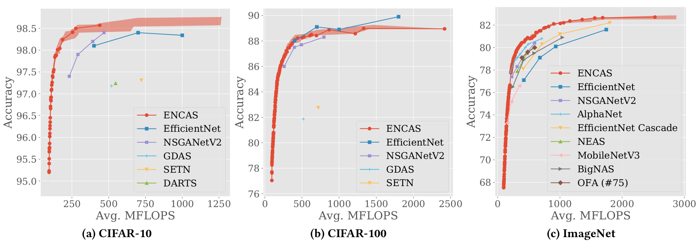
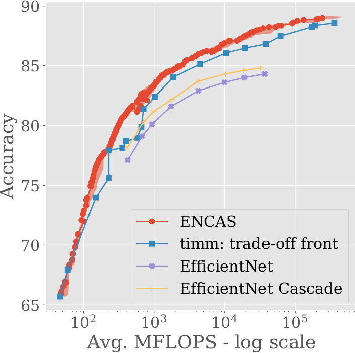

# ENCAS: Evolutionary Neural Cascade Search across Supernetworks

ENCAS is a NAS algorithm for efficiently searching network architectures to be combined in a cascade.
It utilizes multiple pretrained supernetworks that have different operations and search spaces. 
Our algorithm is multiobjective: in a single run, it finds many models with different trade-offs between accuracy and FLOPS. 

This repo contains the code for our paper [Evolutionary Neural Cascade Search across Supernetworks](https://arxiv.org/abs/2203.04011), which includes 
ENCAS, ENCAS-joint, and reproduction of [Neural Architecture Transfer](https://arxiv.org/abs/2005.05859).

## Results

This is a subset of our results, see the paper for others.

### Comparison with other NAS approaches 

On CIFAR-10 and ImageNet ENCAS dominates previous approaches; on CIFAR-100 ENCAS is better than previous NAS approaches, on par with EfficientNet B0-B2, and worse than B3.



### Applying ENCAS to ``timm`` models

ENCAS can be used to search for cascades of arbitrary models: we applied it to 518 models from ``timm`` (PyTorch image models, https://github.com/rwightman/pytorch-image-models) and achieved a dominating trade-off front.



## Reproducing the results

### General notes

Setting seed doesn't lead to complete reproducibility because to achieve it, 
PyTorch needs to be restricted to deterministic operations, which negatively affects 
speed. However, the results should be very close in terms of metrics (since for our paper we ran each experiment 10 times).

Since NAT spends roughly half of the time not using GPU, the code was written to allow 2 runs to use a single GPU (this is achieved by only working with GPU in subprocesses, which are killed once they are done, allowing the next subprocess to use the entire VRAM).

The data of all our experiments (including the supernetwork weights) is available [here](https://surfdrive.surf.nl/files/index.php/s/p53yWOhZ5g2UXyc).

### Preparation

Clone the repo.

Set `PYTHONPATH`: `export PYTHONPATH=PATH_TO_ENCAS`,
where `PATH_TO_ENCAS` is the path where you cloned ENCAS (e.g. `"/export/scratch3/aleksand/encas"`).

Put the pretrained supernetworks into the 'data' folder (put the two OFA supernetworks into a subfolder "ofa", rename them to supernet_w1.0 and supernet_w1.2). Links:

* OnceForAll-w1.0, OnceForAll-w1.2, ProxylessNAS (link from https://github.com/mit-han-lab/once-for-all): https://drive.google.com/drive/folders/10leLmIiMtaRu4J46KwrBaMydvQt0qFuI
* AlphaNet (link from https://github.com/facebookresearch/AlphaNet): https://drive.google.com/file/d/1CyZoPyiCoGJ0qv8bqi7s7TQRUum_8FeG/view
* AttentiveNAS (link from https://github.com/facebookresearch/AttentiveNAS): https://drive.google.com/file/d/1cCla-OQNIAn-rjsY2b832DuP59ZKr8uh/view

Set "NAT_PATH" in utils.py to the full path to the directory where you cloned this repo.

To create ImageNet validation set, Download ImageNetV2 and combine the three datasets, removing duplicates. You should get 20,683 images.

To store labels of validation & test sets for the search, run ``python data_utils/store_labels.py``.

Clone the MO-GOMEA [repo](https://github.com/AwesomeLemon/MO-GOMEA-for-ENCAS) & follow the instructions there to compile it.

### Conda environment

Create conda envronment from the ``data/env_encas.yml``.

Then, run:

```
pip install git+https://github.com/AwesomeLemon/once-for-all
pip install git+https://github.com/AwesomeLemon/pySOT
```

(these are my forks of those repos with a couple of minor bugs fixed)

Finally, activate the environment.

### Reproducing Neural Architecture Transfer (NAT)

Configs: `configs_nat/cifar[10|100]_reproducenat.yml`

Change ``data`` (path to the dataset), ``path_logs`` (path to the logs folder), ``n_runs`` (how many runs/seeds).

Run ``python nat_run_many.py --config configs/cifar10_reproducenat.yml``

### NAT with better hyperparameters (for ENCAS)

Configs: `configs_nat/[cifar10|cifar100|imagenet]_r0_[alpha|attn|ofa10|ofa12|proxyless]_sep.yml`

Change ``data`` (path to the dataset), ``path_logs`` (path to the logs folder), ``n_runs`` (how many runs/seeds).

Run ``python nat_run_many.py --config configs/cifar10_r0_alpha_sep.yml`` for the dataset and the supernetwork of your choice.

### ENCAS-joint

Configs: `configs_nat/cifar[10|100]_r0_[alphaofa|5nets].yml`

Change ``data`` (path to the dataset), ``path_logs`` (path to the logs folder), ``n_runs`` (how many runs/seeds), ``gomea_exe`` (path to the MO-GOMEA executable you compiled).

Run ``python nat_run_many.py --config configs/cifar10_r0_5nets.yml``. 
The included configs are either for all 5 supernetworks or for AlphaNet+OFA-w1.2, but any combination of the supernetworks can be used.

### ENCAS

Configs: `configs_encas/[c10|c100|img]_5nets.yml`

Make sure that all the relevant supernetworks have been trained with NAT (see [above](#NAT-with-better-hyperparameters-(for-ENCAS))).

Run ``python encas/post_hoc_search_run_many.py --config configs_encas/c10_5nets.yml``

There are additional configs for running baselines: "_greedy" for GreedyCascade (http://proceedings.mlr.press/v80/streeter18a/streeter18a.pdf), "_random" for random search. Also, configs with "_ens" are for searching ensembles instead of cascades.

### ENCAS-joint + ENCAS

Configs: `configs_encas/[c10|c100|img]_5nets_join.yml`

Make sure that ENCAS-joint has finished (see [above](#ENCAS-joint)).

In ``after_search/extract_store_eval.py`` modify the parameters passed to the ``extract_store_eval`` and execute ``python after_search/extract_store_eval.py``

Run ``python encas/post_hoc_search_run_many.py --config configs_encas/c10_5nets_join.yml``

### ENCAS for ``timm`` models

Config: `configs_encas/timm.yml`

In ``after_search/extract_store_eval.py`` modify the path to ImageNet.
Run ``python after_search/store_outputs_timm.py`` to save the outputs of ``timm`` models on validation and test.

Run ``python encas/post_hoc_search_run_many.py --config configs_encas/timm.yml``

### Figures

The code to reproduce the figures in our paper is also published. Once you have run the experiments referenced in a figure,
you can create the figure by uncommenting & running the relevant lines in ``plot_results/plot_results_[cifar10|cifar100|imagenet]``
(the figure numbers are mentioned in the code).

## Acknowledgments for code

We relied in large part on the code for NsgaNetV2 (https://github.com/mikelzc1990/nsganetv2),
as well as on the parts of the NAT codebase privately provided to us by Zhichao Lu, for which we are very grateful.

The supernetworks' code is taken from the corresponding repos: OFA (https://github.com/mit-han-lab/once-for-all),
AlphaNet (https://github.com/facebookresearch/AlphaNet), AttentiveNAS (https://github.com/facebookresearch/AttentiveNAS)
